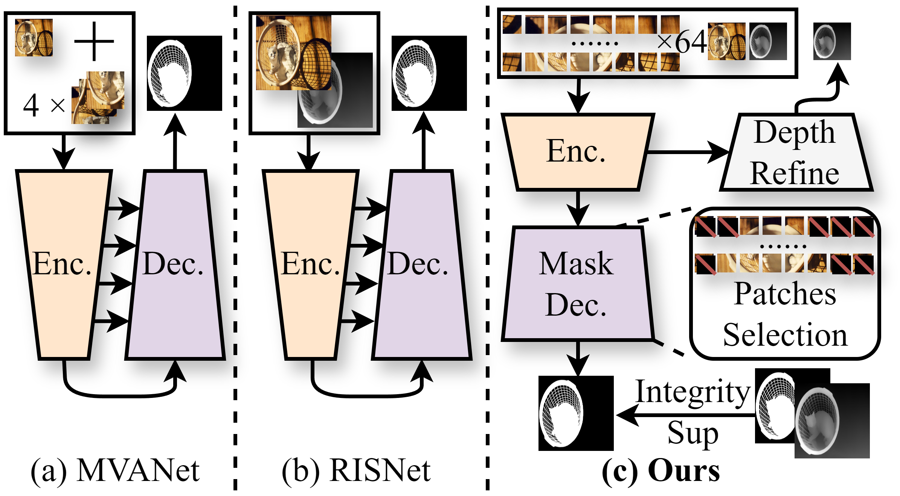
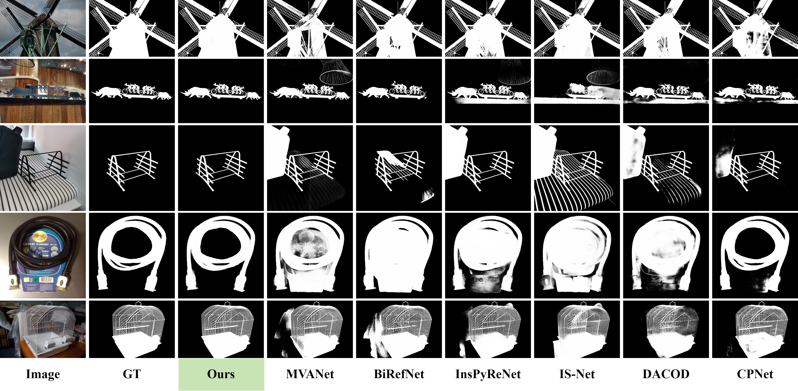

# PDFNet

This is the official PyTorch implementation of [PDFNet](https://arxiv.org/abs/2503.06100).

"About general-model, I am trying to train on DIS-5K, HRSOD-TR, UHRSD-TR and UHRSD-TE. But it will use a lot of time. Just on DIS-5K-TR it takes 2days on RTX4090 (T_T). If you have any personal use cases, you can very easily train PDFNet on a graphics card with the same or more than video memory specification as that of the RTX 4090. It is worth noting that during the inference process, an input of 1024x1024 occupies 4.9 gigabytes of video memory. : )"
<div align='center'>
<a href='https://arxiv.org/abs/2503.06100'></a>&ensp;
<a href='https://huggingface.co/spaces/Tennineee/PDFNet'></a>&ensp;
</div>

[](https://paperswithcode.com/sota/dichotomous-image-segmentation-on-dis-vd?p=patch-depth-fusion-dichotomous-image)
[](https://paperswithcode.com/sota/dichotomous-image-segmentation-on-dis-te1?p=patch-depth-fusion-dichotomous-image)
[](https://paperswithcode.com/sota/dichotomous-image-segmentation-on-dis-te2?p=patch-depth-fusion-dichotomous-image)
[](https://paperswithcode.com/sota/dichotomous-image-segmentation-on-dis-te3?p=patch-depth-fusion-dichotomous-image)
[](https://paperswithcode.com/sota/dichotomous-image-segmentation-on-dis-te4?p=patch-depth-fusion-dichotomous-image)
[](https://paperswithcode.com/sota/rgb-salient-object-detection-on-hrsod?p=patch-depth-fusion-dichotomous-image)
[](https://paperswithcode.com/sota/rgb-salient-object-detection-on-uhrsd?p=patch-depth-fusion-dichotomous-image)

> # Patch-Depth Fusion: Dichotomous Image Segmentation via Fine-Grained Patch Strategy and Depth Integrity-Prior
>
> Xianjie Liu, Keren Fu, Qijun Zhao
>
> arXiv:2401.00248
> 
> 💻2025/3/27: We add a Hugging Face Space using CPU. You can give it a try, and each attempt will take approximately 1 minute!
> 
> 🤖2025/3/23: We add a Demo jupyter notebook and you can easily use it to try!
> 
> 🔥2025/3/13: We released the code and checkpoints on GitHub.
> 
> 📕2025/3/10: We released the paper on the ArXiv.

🔥If you are interested in **Dichotomous Image Segmentation** (DIS), we highly recommend checking out our additional project [Awesome Dichotomous Image Segmentation](https://github.com/Tennine2077/Awesome-Dichotomous-Image-Segmentation/tree/main). This project compiles all significant research and resources related to DIS, providing comprehensive references and inspiration for your research and practice. We hope this resource list will help you better understand and apply DIS techniques, driving more accurate image segmentation tasks.

# Abstract

Dichotomous Image Segmentation (DIS) is a high-precision object segmentation task for high-resolution natural images. The current mainstream methods focus on the optimization of local details but overlook the fundamental challenge of modeling the integrity of objects. We have found that the depth integrity-prior implicit in the the pseudo-depth maps generated by Depth Anything Model v2 and the local detail features of image patches can jointly address the above dilemmas. Based on the above findings, we have designed a novel Patch-Depth Fusion Network (PDFNet) for high-precision dichotomous image segmentation. The core of PDFNet consists of three aspects. Firstly, the object perception is enhanced through multi-modal input fusion. By utilizing the patch fine-grained strategy, coupled with patch selection and enhancement, the sensitivity to details is improved. Secondly, by leveraging the depth integrity-prior distributed in the depth maps, we propose an integrity-prior loss to enhance the uniformity of the segmentation results in the depth maps. Finally, we utilize the features of the shared encoder and, through a simple depth refinement decoder, improve the ability of the shared encoder to capture subtle depth-related information in the images. Experiments on the DIS-5K dataset show that PDFNet significantly outperforms state-of-the-art non-diffusion methods. Due to the incorporation of the depth integrity-prior, PDFNet achieves or even surpassing the performance of the latest diffusion-based methods while using less than 11% of the parameters of diffusion-based methods.


## Installation

### Using UV (Recommended)
```bash
# Install UV
powershell -ExecutionPolicy ByPass -c "irm https://astral.sh/uv/install.ps1 | iex"  # Windows
# curl -LsSf https://astral.sh/uv/install.sh | sh  # macOS/Linux

# Install PDFNet with all dependencies (including MoGe)
uv pip install -e .

# Download required model weights
python download.py
```

### Traditional Method
```bash
conda create -n PDFNet python=3.11.4
conda activate PDFNet
pip install -r requirements.txt  # Note: This method requires manual MoGe setup
```

For detailed installation instructions, see [INSTALL.md](INSTALL.md).
## Dataset Preparation

Please download the [DIS-5K dataset](https://github.com/xuebinqin/DIS) first and place them in the "**data**" directory. The structure of the "**data**" folder should be as follows:
```
PDFNet
└──DATA
	└──DIS-DATA
	    └── DIS-TE1
	    ├── DIS-TE2
	    ├── DIS-TE3
	    ├── DIS-TE4
	    ├── DIS-TR
	    └── DIS-VD
	    	├──images
	    	└──masks
```
Download [Swin-B weights](https://github.com/SwinTransformer/storage/releases/download/v1.0.0/swin_base_patch4_window12_384_22k.pth)  into '**checkpoints**'.

### Depth Preparation
PDFNet now uses [MoGe (Monocular Geometry)](https://github.com/microsoft/MoGe) with the `Ruicheng/moge-2-vitl-normal` model for more accurate depth estimation instead of DepthAnything V2. MoGe is automatically installed as a dependency when you install PDFNet with UV.

Use the '**MoGe/Depth-prepare.ipynb**' notebook to generate pseudo-depth maps for training and testing. The moge-2-vitl-normal variant provides better depth integrity and accuracy compared to previous methods.

# Training

Run
```bash
# Using the new UV package structure
pdfnet-train --data_path DATA/DIS-DATA --model PDFNet_swinB

# Or using the package directly
python -m pdfnet.train --data_path DATA/DIS-DATA --model PDFNet_swinB
```
If you want to change the training datasets, you can modify the `src/pdfnet/dataloaders/Mydataset.py` `build_dataset` function to add other datasets.

# Test and metric

The testing and metric tools are available in the package. You can modify the settings in `src/pdfnet/metric_tools/Test.py` and `src/pdfnet/metric_tools/soc_metrics.py` as needed.

Run testing:
```bash
python -m pdfnet.metric_tools.Test
```

# Different training datasets results and checkpoints

| Training Dataset       | Checkpoints and Validation Results                                                                                        |
| ---------------------- | ------------------------------------------------------------------------------------------------------------------------- |
| DIS-5K TR              | [DIS Checkpoint and visual results](https://drive.google.com/drive/folders/1dqkFVR4TElSRFNHhu6er45OQkoHhJsZz?usp=sharing) |
| HRSOD -TR + UHRSD - TR | [Only Visual results](https://drive.google.com/file/d/1DKL1Jonx_PR1HF6m0D4lyUQtAmR7oQrd/view?usp=sharing)                 |

You also can use the '**demo.ipynb**' to try PDFNet easily!
# Compare
## Visual results

# BibTeX

Please consider to cite PDFNet if it helps your research.
```
@misc{liu2025patchdepthfusiondichotomousimage,
      title={Patch-Depth Fusion: Dichotomous Image Segmentation via Fine-Grained Patch Strategy and Depth Integrity-Prior}, 
      author={Xianjie Liu and Keren Fu and Qijun Zhao},
      year={2025},
      eprint={2503.06100},
      archivePrefix={arXiv},
      primaryClass={cs.CV},
      url={https://arxiv.org/abs/2503.06100}, 
}
```
